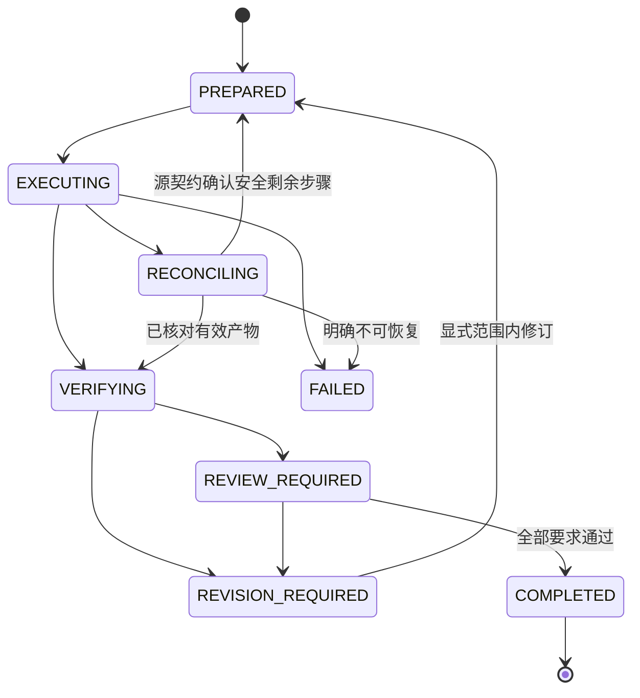

## Context

2026-10-08 基线：插件 0.1.0-dev.1 包含与技能源完全一致的 36 个技能文件；插件快照测试 1 项曾通过，六项独立技能离线查询曾通过。临时副本证明 sourceProject、sourceVersion、releaseTag 改变仍可通过当前校验。没有 Git、宿主验收、插件本地 Harness 或正式发行身份。Dreamina 仅作为设计参考，其未提交安全改动和历史付费/Windows证据不构成本项目证据。

## Dreamina 对照分析与采纳范围

对照 `dreamina-canvas-plugin` 的源技能锁与插件本地 Harness 分工、任务状态/恢复、能力发现、分层验证和发行门禁。Dreamina 是多媒体云端工作流，本插件面向本地排版，因此只采用可迁移的治理和路由模式，不复制业务参数、账户或云端副作用语义。CodeGraph 在参考目标未初始化；本节基于插件元数据、技能入口、Harness、验证脚本和工作流文件的直接阅读。

| Dreamina 插件做法 | DesignCraft 当前覆盖 | 需要补充/约束 | 规格与任务 |
|---|---|---|---|
| 外部技能锁与本地 Harness 各自单一所有权 | 源身份、候选清单及 PH-01 已定义 | 保持技能事实回源；插件只维护编排与消费契约 | SP-01/03、PH-01，既有任务 1.1～1.5/2.2 |
| 能力探测后按明确状态选择路由 | HI-01/04 有宿主入口与支持矩阵 | 在副作用前输出本机依赖/CLI/版本/共享契约的就绪状态，失败不触发安装或编辑 | 新增 HI-05、任务 3.6 |
| 持久任务身份、UNKNOWN 核对与原身份恢复 | PH-02 与技能源 EX 已定义 | 源检查点未完成前继续禁止 resume；不将自由文本视作核对证据 | PH-02、任务 2.4 |
| 产物清单、重开、逐页审阅和完成门禁 | AV-01～AV-04 与 PH-03 已定义 | 只有当前候选的验证器报告可进入完成门禁；真实审阅仍须保留来源和候选绑定 | PH-03、任务 2.5/4.4 |
| 多层包/宿主/CI/发行验证 | RG-01/02/03 已定义 | 本地测试、远端 CI、真实 Codex、原生创作与正式发行状态互不替代 | RG-01～RG-04、任务 4.1～5.5 |

新增预检明确为只读能力报告，不能绕过源方 EX/AV 契约，也不把“可发现”升级成“可执行”或“已验收”。

## Goals / Non-Goals

**Goals:** 六项外部技能加一个本地 Harness；来源、运行与交付三个身份层可核对；单任务可恢复、显式修订可追踪；首个 Codex 宿主有真实发现与调用证据。

**Non-Goals:** 不复制技能源执行逻辑；不创建空 MCP/hooks；不自动多轮、不搬入计费授权；额外宿主、平台、ArtCraft 协议另立变更，不能当成本次已具备能力。

## Decisions

### 1. 单一维护源与本地 Harness

外部六项技能只由 designcraft-skills 发布/同步；本地 designcraft-harness 独立登记在 plugin-local-skills.json 或等价明确清单，来源锁只记录外部技能。完整集合必须等于外部集合与本地集合的无冲突并集。

Harness 通过公开 commands.py 网关及源方版本化契约编排，不导入私有 Python 函数。目录/安装/参数与执行回执由源 change harden-designcraft-skill-workflows 的 SK/EX/AV/QG 定义；插件仅定义调用兼容范围和任务级门禁，避免两套实现漂移。

### 2. 本地任务状态

任务目录位于独立可写用户数据区域；只读插件缓存保持不可变。状态包含 taskId、目标与范围、所选技能、当前阶段、runId 引用、检查点、验证/审阅引用、未完成项和下一动作。状态写入采用原子替换与单任务写锁；并发写入者拒绝或等待，不覆盖对方状态。

RECONCILING 不允许未经核对直接执行。源回执 UNKNOWN 必须保留；缺失或损坏旧状态只读检查。COMPLETED 需要 AV 产物与审阅证据；不能由原生退出码或状态文件存在推导。用户中断不等于所有派生进程停止。

### 3. 候选和发行身份

候选继续使用 candidate-source.json，但新增 schemaVersion 与显式 candidate 类型；sourceProject 必须对应 DesignCraft 技能源，sourceVersion 对应携带的源身份清单，releaseTag 必须为空。验证无需读取真实兄弟仓：输入源身份清单与内容随候选携带，开发同步时再与源项目核对。

正式来源锁使用 repo、ref/releaseTag、peeled commitSha、sourceVersion、技能集合与内容摘要。离线核验内容，在线核验 ref/commit；分别出结果。插件版本与技能源版本独立，不要求长期同号，但宿主/市场的插件版本必须匹配发布。

快照摘要防意外漂移，不是签名信任证明；同时改元数据和内容不会仅靠本地摘要被识别，正式发行通过受信 repo 与 commit 锚定。对 metadata 字段及清单执行完整 schema/语义验证，不只比较 $schema URL。

### 4. 同步与迁移

同步器仍由技能源维护；插件文档明确其位置和调用条件。验证旧快照后在暂存区域准备新内容，最终核对一致性并发布；任何失败保持旧可用快照，或留下明确不可消费的候选状态。拒绝用户漂移、源删除和来源身份错配，已发布来源不被本地候选覆盖。运行产物和本地 Harness 不混进外部锁摘要。

### 5. Codex 首个宿主

补充必要的 Codex 技能发现元数据和插件清单，use 为默认隐式入口，原子技能/Harness 显式调用。源技能元数据回源维护，本地 Harness 元数据留插件。其他宿主不批量生成占位配置；MCP 若未来接入，先建立服务生命周期、协议及实际宿主测试再声明。

离线正反例检查不等于模型路由证明；安装、发现、自然语言路由、实际原生调用各有证据。测试包括通用手册、已有工程修订、显式导出、无关请求、缺运行时和重启恢复。安装授权仅在确实缺少时确认，已授权任务范围无需在每阶段重复审批。

### 6. 门禁与发布

测试使用临时源/插件 fixture，不依赖同机兄弟目录。CI 分离离线层与真实目标环境，报告执行/未执行/失败；先验证当前 macOS arm64 与实际 Python 版本，扩展矩阵按需求逐项验收。

正式发布顺序：源规范实现验证 → 源发行 tag/commit → 插件锁更新和候选验证 → 宿主/产物回归 → 插件发行 → 市场一致性。市场版本/来源应从单一元数据生成；当前不得填充未存在的公开 repo/tag 作为事实。发布需对应授权，不因 tasks 存在自动执行。

## Cross-project dependencies

| 插件工作 | 必须等待的源契约/证据 | 可独立推进的部分 |
|---|---|---|
| PH-01/02 | EX-01～EX-05 版本化回执与恢复 | 本地状态机、fixture 和非法迁移测试 |
| PH-03 | AV-01～AV-04 产物/重开/审阅 | 完成门禁的拒绝测试 |
| HI-01/03 | SK 六项职责、自包含入口 | 宿主清单静态校验 |
| SP-04 | 技能源受控同步工具 | 来源身份拒绝测试 |
| RG-03 | 源 QG 证据与正式来源身份 | 候选/发行模式校验 |

## Risks / Trade-offs

- [已有六技能数量断言与新增 Harness 冲突] → 两类清单独立、并集校验，测试禁止遗漏或重复。
- [来源未发布导致在线发行验证不可执行] → 保留候选模式，正式发布任务开放，不制造 tag。
- [宿主行为与元数据不一致] → 真宿主场景证据优先，不能用配置文件存在替代。
- [同步失败或外部修改造成半快照] → 暂存核验与拒绝消费门禁。
- [用户状态文件或旧回执不完整] → 保留现场，只读诊断，不自动重放。

## Migration Plan

先收紧 SP 身份验证及快照集合测试，再接入源 EX/AV 契约实现 PH，随后完成 HI 真宿主及 RG 发布门禁。旧 candidate 元数据迁移前保留副本，不直接将其声明为发行锁；旧状态保留原格式并可只读显示。回退时使用先前验证的插件与来源锁，保留任务数据，不用重置用户工程恢复。实现和验收完成前不 sync/archive 本 change。
